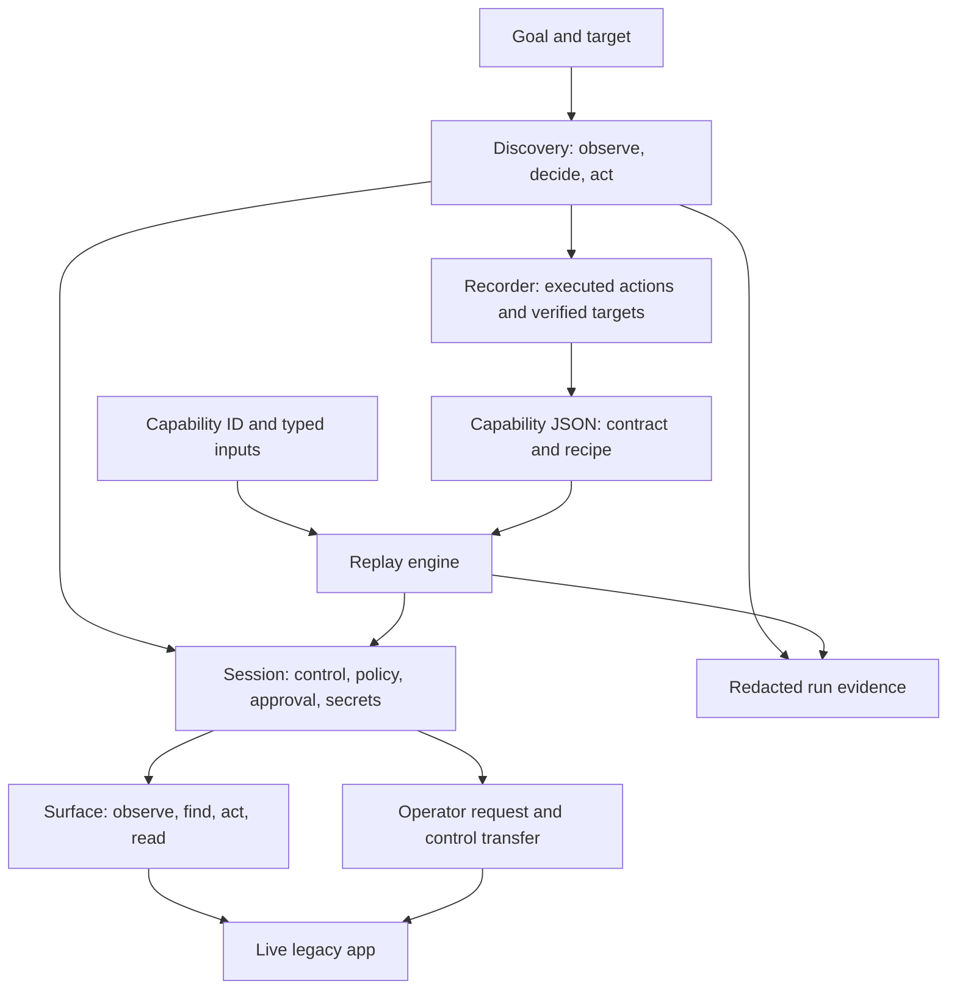

# Presentation Brief & Study Guide

**Project:** Computer-Use Automation System for legacy financial applications  
**Review:** September 15, 2026. Astra reviewed the fixes and reported no remaining submission blockers for the assignment scope. This is a validated prototype; production deployment requires the documented security and operational work.

Read sections 1–4 first for the story, 5–10 for technical understanding, and 11–13 for rehearsal. The submission design document is [REPORT.md](REPORT.md); operating instructions are in [README.md](README.md).

## 1. Your opening pitch

> Banks have legacy applications with no integration API. This project lets an LLM discover how to perform a task through the UI, then saves the successful actions as a typed, versioned capability. Future calls supply inputs and execute that capability without model decisions. Replay checks its work, distinguishes business outcomes from operational failures, and can transfer the same browser session to a human. I demonstrated both reading a savings balance and opening a sub-account with approval, using a deliberately legacy local application and synthetic data.

**The sentence to remember:** “The model discovers; the artifact becomes the contract; deterministic replay executes it.”

The assignment values coherent design and a complete working flow. Its environment has stable UIs but frequent runtime exceptions, different surface technologies, and hundreds of institutions sharing vendor products. Stable UIs make reuse practical; runtime exceptions make error handling essential. An available business API would be preferred, but that case is outside this assignment.

## 2. Requirements and what you delivered

| Assignment requirement | Your implementation |
|---|---|
| Goal + target → actual LLM-driven UI actions | Claude discovery loop, configurable app/base URL/entry path, live Chromium |
| Reusable typed/versioned artifact | Zod-validated capability JSON, inputs, outputs, targets, steps, checks and provenance |
| Replay without model decisions | Deterministic executor with bounded waits and explicit result categories |
| Policy and sensitive-data handling | Origin/path/action allowlists, approval, environment secrets, redaction and masking |
| Debuggable evidence | Structured events, discovery transcripts, screenshots and failure HTML |
| Human escalation and live takeover | Operator request, control turn, same browser, captured actions, checked resumption |
| Heterogeneity and multi-tenant design | Surface interface; proposed vendor profiles, tenant overlays and drift management |
| Required deliverables | Public repository, README, seven-heading REPORT, discovery and replay evidence |
| Optional depth | Multi-run stability and content-bound approval |

**Real versus simulated:** the bank application and its data are synthetic. The browser interaction, model API discovery, artifact generation, replay, policy checks and control-transfer mechanism are real. Evidence operators are scripts using the real operator API and live browser; they are explicitly labelled. Desktop support, tenant overlays and remote operations are design proposals.

## 3. Specifications at a glance

| Area | Specification |
|---|---|
| Runtime | TypeScript, Node.js; validated locally on Node 24 |
| Libraries | Playwright for Chromium, Express for local apps, Zod for schemas, Vitest for tests |
| Model | Anthropic SDK; configured default `claude-opus-5`, adaptive thinking, medium effort |
| Target | Local CU*LEGACY teller app; framesets, tables, weak labels, no test IDs |
| Entry points | CLI: `discover`, `replay`, `show`, `list`, `stability`, `approve`, `app` |
| Storage | Capability JSON/Markdown, per-run event/transcript files, screenshots and HTML |
| Discovery bound | Default maximum 30 turns; help after no progress/repeated failures |
| Step wait | Typically 10 seconds, then one extra wait; recovery counts are capped |
| Operator | Local console on port 4100; app normally on port 4000 |
| Dependencies at runtime | Replay needs Chromium and the target app; only discovery needs model access |

There are two saved capabilities:

- **Savings lookup:** `cu-legacy.get-savings-balance@1.0.0`, approved. Input: six-digit `memberNumber` string. Output: numeric `savingsBalance`. Five recorded actions; the original discovery took six model turns including `finish`.
- **Open sub-account:** `cu-legacy.open-sub-account@1.0.0`, draft. Inputs: `memberId`, `product` enum, `openingDeposit` string matching an amount pattern, and `fundFromSuffix` enum. Output: `confirmationNumber` string. Eleven actions; original discovery took twelve turns. The Confirm action requires approval.

The declared input type for an amount is a validated string because UI forms accept text. The extracted money output becomes a JavaScript number. A production financial integration should use decimal or integer-minor-unit money representation.

## 4. Architecture: explain the boundaries



Keep these three responsibilities distinct:

1. **Surface knows the UI technology:** how to observe frames, identify controls, click, type and read.
2. **Session knows whether an operation is permitted:** policy, control ownership, risk approval and secret injection. Both `act()` and `read()` go through authorization.
3. **Discovery/replay know the workflow:** discovery asks a model what comes next; replay reads the next instruction from an artifact.

The app **profile** contains shared knowledge such as sign-on, known screens and sensitive labels. The **policy** contains permissions and risk rules. The **capability** describes one callable task. A capability still requires its profile, policy and surface implementation to execute.

## 5. Walk through one run

### Discovery: turn an example into a reusable flow

1. Load profile, policy and environment credentials; register declared sensitive values before logging.
2. Open Chromium and sign on through Session. Authentication is handled outside the model loop.
3. Observe screen text with temporary `[ref]` identifiers and a masked screenshot.
4. Send the model the goal, prior action history and current observation. It chooses one tool.
5. Resolve the chosen reference and verify reusable locators. A reference is valid only for that observation; it is not the saved replay locator.
6. Authorize and execute the action, then record what actually happened.
7. Repeat until `finish`, an intervention, failure or the turn limit. `finish` must name visible success text.
8. Compile the capability, validate references, reject detected sensitive literals, save a new draft version, and write evidence.

For savings lookup, the five actions are: **open inquiry → enter member number → inquire → open member detail → extract current savings balance**.

### Replay: invoke the learned capability

A caller supplies the capability and inputs. Replay checks the input contract and approval state before launching its browser, signs on, and performs the saved steps. The CLI may start the local mock server before engine preflight; invalid input still prevents browser interaction. Each step resolves a target, authorizes the operation and verifies its checkpoints. Final checks and complete declared outputs are required for success.

Member `100234` produced the original savings example. Replaying for synthetic member `100587` returns `8210.95`, demonstrating parameter reuse rather than memorization of a balance.

**Deterministic means the decision procedure is fixed.** It does not mean business data, elapsed times or newly generated confirmation numbers are identical across calls.

## 6. Understand the artifact and locator strategy

A capability has two halves:

- **Contract:** identity/version, typed inputs, outputs, business outcomes, risk and approval state.
- **Recipe:** named targets, ordered actions, checks, timeout values and completion conditions.

The important parameterization looks like this:

```json
{
  "do": {
    "action": "fill",
    "target": "memberNumberBox",
    "value": "{{inputs.memberNumber}}"
  }
}
```

For a balance, the robust locator describes meaning:

```json
{ "by": "tableCell", "row": "REGULAR SAVINGS", "column": "Current Bal" }
```

That is easier to review than “third cell in the seventh row.” The recorder tests each alternative against the chosen element and discards positional CSS. At replay, an alternative must match exactly one visible control. No matches allow a fallback; multiple matches stop. A fallback success emits a warning so drift is observable.

The alternatives for each frame are evaluated in one page snapshot. Previously, navigation between separate evaluations could make a good primary locator miss and expose a bad fallback. The corrected test fixture also identifies both row and column.

Zod validates structure; additional checks validate referenced targets/outputs and duplicate step IDs. A SHA-256 content hash binds approval to the capability content. Editing that content invalidates approval. This is not a signature or a full bundle-integrity system: profile/policy changes are not covered by the capability hash.

## 7. Error handling: the distinction interviewers will test

| Situation | Behavior | Why |
|---|---|---|
| Malformed member input | `failure: invalid_input` before opening a browser | Caller broke the contract |
| Well-formed member does not exist | `business_outcome: MEMBER_NOT_FOUND` | Valid answer to a valid request |
| Maintenance notice | Dismiss known notice and record recovery | Explicitly recognized recoverable state |
| Expired session | Sign on and restart, if no irreversible action has run | Safe recovery before possible side effects |
| Slow load | One extra wait; bounded recovery count | Tolerate delay without waiting forever |
| System error | `failure: app_error` with evidence | App could not execute normally |
| Unknown dialog/checkpoint failure | Stop or escalate when enabled | Continuing would require guessing |
| Ambiguous target | Stop or escalate | Clicking the wrong control is worse than failing |
| Irreversible step without operator | `failure: approval_required` | No unauthorized submission |

Recoveries are recorded within the eventual result; they are not a separate top-level outcome. Failures include the step, expected and observed state, category, retryability, and evidence when available.

After an irreversible action, session loss stops replay. Retrying a potentially completed transaction could duplicate it. This is conservative recovery, **not an exactly-once transaction guarantee**. Production would need reconciliation against transaction identifiers and application-specific idempotency where available.

## 8. Human handoff and safety

### Who owns the session?

The state is `{ controller, turn }`. The controller is `automation`, `nobody`, or `human`. Every transfer increments the turn:

```text
automation, turn 1 → nobody, turn 2 → human, turn 3 → automation, turn 4
```

A runner holding turn 1 cannot act after ownership has changed. Session checks ownership before an operation and again after asynchronous authorization work. This is a **fencing token**: a number that rejects stale ownership.

The operator takes over the same Chromium window, not a new login. Page scripts record clicks and changes during human control without collecting typed values. On return, replay can retry, continue from a selected step, verify completion, or abort. Continuing checks the preceding step's checkpoint. A missed response deadline fails the run.

The local mechanism coordinates automation; it does not physically prevent someone from touching the browser outside their turn. Remote enforcement, identity and durable leases belong in the production design.

### What protects the run?

- **Allowlist:** approved origins/routes and action types; extraction is checked too. A network guard provides another layer.
- **Risk rules:** target names, marked routes and declared action risk can require approval. A model cannot lower policy risk. The demo auto-confirm override must remain off during the approval demonstration.
- **Secrets:** environment values are filled at sign-on. Do not put passwords in goals. App-displayed identifiers such as the teller ID may still appear on screen.
- **Text evidence:** known sensitive values and recognizable patterns are redacted. Sensitive output values are withheld from persisted results.
- **Goal privacy:** raw goals are omitted from logs. Callers must declare non-pattern PII, such as names and addresses, with `sensitiveValues` / `--sensitive-value`; model-declared sensitive inputs are registered before decision logging.
- **Images:** mask sensitive fields named in the app profile and password inputs. Traces are disabled.

Be precise about the limits: arbitrary undeclared PII cannot be reliably recognized; masking depends on the profile; the model receives page text during discovery; the operator console has no authentication; the policy does not inspect POST bodies. Synthetic demo data avoids treating this prototype as a production banking deployment.

## 9. Scaling and trade-offs

| Decision | Benefit | Cost or limit |
|---|---|---|
| Discover once, replay many | Reviewable execution and no inference calls during replay | Learned capabilities require testing and maintenance |
| One action per model turn | Simple recording, policy and intervention boundaries | Extra model round trips |
| Semantic table/role locators | Practical for legacy web without test IDs | Still depends on readable DOM structure |
| JSON contract + Zod | Serializable, typed and inspectable | Schema supports a deliberately small vocabulary |
| Single process | Easy to run and understand | No crash-resilient session orchestration |
| Local fake application | Repeatable errors and safe synthetic data | Does not establish coverage of real vendor products |

The proposed reuse model is **vendor/version profile + base capability + tenant overlay**. An overlay would override targets or steps for one institution. The merged result would have its own hash and approval. Fingerprints, fallback warnings, failure rates and canary runs would detect drift.

Desktop support requires a new Surface adapter, schema extensions for desktop locators, and surface construction changes. OCR-only environments need different perception and stronger verification. These are credible extension points, not completed features.

## 10. What the final review verified

Astra's review concluded: **“Satisfied for the assignment submission scope … No remaining submission-blocking findings.”** This assessment covers the local fixes; they must be committed and pushed before the public submission contains them.

| Check | Result |
|---|---|
| Full unit/integration suite | 42/42 passed across 8 files |
| TypeScript and patch whitespace checks | Passed |
| Repeated ordinary lookup | 10/10 fixture + 10/10 saved capability; correct output, no locator warnings |
| Isolated offline evidence regeneration | All 10 replay scenarios matched expected results; 2 historical discovery entries retained |
| Stability during regeneration | 10/10 successful lookups and 10/10 expected not-found outcomes |
| Seeded sensitive-data scan of regenerated text | No seeded name, SSN, phone or password matches |

The original two genuine Claude discovery runs remain in `evidence/`; the review used those records and did not make another paid discovery call. Automated discovery tests use a scripted model. Evidence regeneration and repeated verification used temporary directories, preserving the original checked-in examples.

The review fixed: extraction bypassing policy; early sensitive-goal logging; an ambiguous fallback/navigation race; short inputs remaining literal; the draft demo sequence; and offline evidence regeneration inconsistencies. These corrections have targeted regressions. Passing tests establishes behavior in this controlled app, not universal reliability across bank systems.

## 11. Presentation and demo plan

**Suggested 8-minute structure:** problem and pitch (1 minute), architecture/artifact (2), live replay and outcomes (2), handoff/approval (2), trade-offs and next steps (1). Use the saved discovery transcript as proof if live API latency would distract.

### Reliable offline sequence

```bash
# Explain the capability contract first.
npm run cua -- show cu-legacy.get-savings-balance@1.0.0

# Different member from the discovery example.
npm run cua -- replay cu-legacy.get-savings-balance@1.0.0 --input memberNumber=100587

# A valid business outcome.
npm run cua -- replay cu-legacy.get-savings-balance@1.0.0 --input memberNumber=999999

# Live-session handoff; allow about 20 seconds before the request appears.
npm run cua -- replay cu-legacy.get-savings-balance@1.0.0 --input memberNumber=100234 --fault unknown_dialog --escalate
```

For handoff: open `http://127.0.0.1:4100`, take control, click **Acknowledge** in the automation browser, then select `extractSavingsCurrentBalCell` and continue in the console. Show the control-change and human-action events afterward.

For the write approval demonstration, use README §6's pinned sub-account command. Explain that `--allow-draft` permits testing the artifact; it does **not** waive approval for Confirm. Keep `AUTO_CONFIRM_RISKY=false`.

For live discovery, use README §1–3's separate `get-savings-balance-demo` name. Inspect the actual generated input names before replay; model-chosen names can differ. The saved offline example remains pinned and unaffected.

## 12. Likely questions and concise answers

**Why use an LLM if replay is deterministic?**  
The model handles initial exploration and interprets the goal. A reviewed capability removes repeated model decision-making from subsequent executions.

**How is this different from a recorded click macro?**  
It has typed inputs/outputs, semantic targets, checkpoints, business outcomes, bounded recovery, policy, approval and human takeover. It parameterizes an example into a callable contract.

**Is this really computer use if you use Playwright?**  
Yes: discovery observes and acts through the UI. It does not call a business API. This implementation uses DOM-derived semantics with screenshots for context; it does not claim pixel-only or native desktop support.

**Can it learn any bank workflow?**  
No. It demonstrates a bounded vertical slice on one app/profile with a small action vocabulary. New applications need profiles, policies and suitable surface support.

**How do you know the task succeeded?**  
Discovery verifies visible completion text. Replay verifies intermediate/final checks and all declared outputs. Those checks must be reviewed: visible confirmation is not independent proof that a real banking ledger committed correctly.

**Why is not-found not a failure?**  
The lookup completed and returned useful domain information. The caller should distinguish that from an unavailable app or an invalid request.

**Does the hash make it secure?**  
It detects capability changes relative to local approval. It is not signed authorization, tenant identity or protection against someone who can rewrite the local approval files.

**Can a human's work be replayed automatically?**  
Human actions are captured as evidence. Discovery notes the intervention, but does not convert those manual actions into capability steps. Such a draft needs careful review and successful replay before approval.

**What would you build next?**  
Tenant overlays and drift measurement; durable session/handoff orchestration; authenticated remote operators; then one desktop accessibility adapter. Production data handling and transaction reconciliation would also be mandatory.

## 13. Code tour and self-check

Read in this order:

1. [Saved savings capability](capabilities/cu-legacy.get-savings-balance/1.0.0.json): explain its inputs, target alternatives, steps and final checks.
2. [Replay engine](src/replay/engine.ts): follow `runStep`, `watchScreens`, `getHelp` and the result branches.
3. [Session](src/session.ts): explain authorization, approval, `act` and `read`.
4. [Discovery loop](src/agent/loop.ts) and [recorder](src/recorder/recorder.ts): distinguish temporary references from recorded locators and literal values from inputs.
5. [Control turn](src/handoff/control.ts) and [operator console](src/handoff/operator-server.ts): explain who owns the browser and how resumption works.
6. [Evidence index](evidence/README.md): be able to locate proof of each claim.

Before presenting, explain aloud without notes: why there are three result categories; why approval and draft status are separate gates; why a locator needs row AND column; what happens after session loss following Confirm; what the hash does and does not cover; which features are real and which are proposed.

If you can answer those clearly and walk one JSON artifact through the executor, you understand the central design.
